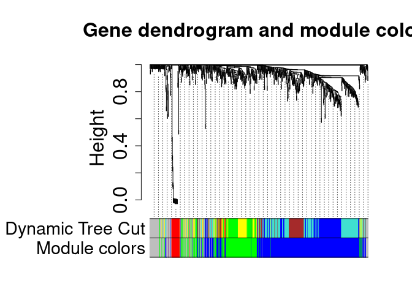

# targidcn 

<!-- badges: start -->
<!-- badges: end -->

Target identification is an essential first step in drug discovery. This
package implements convenient functions for performing target
identification tasks on gene expression data using the WGCNA method.
(“cn” in the package name stands for “correlation network”.)

## :arrow-double-down: Installation

You can install the development version of targidcn from
[GitHub](https://github.com/).

``` r
if (!require("BiocManager", quietly = TRUE))
    install.packages("BiocManager")

BiocManager::install(c("AnnotationDbi", "GO.db", "org.Hs.eg.db", "preprocessCore", "impute"))

if (!require("remotes", quietly = TRUE))
    install.packages("remotes")

remotes::install_github("GHDDI-AILab/target-id-by-WGCNA")
```

## Input data formats

The method can be applied to gene expression data generate by RNA-seq or
Mass Spectrometry (MS).

### RNA-seq data

(preprocessing not available so far)

### Labelled MS data

The expression levels of proteins are stored in the columns with the
prefixes `Ratio H/L` and `Ratio H/L normalized`.

### Label-free MS data

The expression levels of proteins are stored in the columns with the
prefixes `LFQ intensity` or `Intensity`.

## Tutorial

``` r
library(magrittr)
library(targidcn) %>% suppressMessages()

datadir = system.file("extdata", "MS_label-free", package = "targidcn")
assay = ReadProteinGroups(datadir)
assay
#> An object of class ProteinGroups
#> 
#> 111 Experiment(s): "147", "151", "162", ...
#> 1 Assay(s): "Intensity"
#>  1591 features across 111 samples within assay 1.
```

``` r
attributes(assay)
#> $names
#> [1] "Intensity"
#> 
#> $experiments
#>   [1] "147" "151" "162" "167" "170" "216" "217" "218" "220" "221" "224" "241"
#>  [13] "242" "245" "248" "249" "251" "253" "254" "255" "256" "257" "259" "260"
#>  [25] "261" "262" "263" "265" "268" "269" "270" "271" "272" "273" "275" "276"
#>  [37] "277" "281" "282" "284" "285" "286" "289" "290" "292" "511" "518" "519"
#>  [49] "520" "522" "526" "527" "530" "536" "552" "554" "556" "557" "558" "560"
#>  [61] "561" "563" "564" "566" "567" "569" "570" "572" "573" "574" "575" "576"
#>  [73] "577" "578" "580" "581" "584" "585" "586" "587" "588" "589" "591" "594"
#>  [85] "596" "599" "602" "603" "604" "605" "611" "612" "613" "614" "615" "617"
#>  [97] "618" "619" "620" "621" "622" "623" "624" "625" "626" "627" "628" "629"
#> [109] "630" "631" "632"
#> 
#> $filename
#> [1] "/tmp/RtmpXfNjkg/temp_libpath29def3370e224/targidcn/extdata/MS_label-free/MaxQuantOutput/proteinGroups.txt"
#> 
#> $class
#> [1] "ProteinGroups"  "ExpAssayTable"  "ExperimentList" "list"
```

``` r
cn = 
  assay %>% 
  Tidy() %>% 
  QC() %>% 
  Reshape() %>% 
  PickThreshold() %>% 
  AddNetwork() %>% 
  AddConnectivity()
#> Warning: executing %dopar% sequentially: no parallel backend registered
#>    Power SFT.R.sq   slope truncated.R.sq mean.k. median.k. max.k.
#> 1      1  0.75300  1.5600          0.825  405.00    430.00  546.0
#> 2      2  0.44300  0.5490          0.285  244.00    259.00  408.0
#> 3      3  0.00234 -0.0405          0.125  162.00    167.00  322.0
#> 4      4  0.16000 -0.4580          0.459  113.00    113.00  263.0
#> 5      5  0.31700 -0.7250          0.649   82.40     78.30  220.0
#> 6      6  0.40700 -1.0800          0.749   62.10     55.80  187.0
#> 7      7  0.48100 -1.1700          0.815   48.00     40.70  161.0
#> 8      8  0.55400 -1.2800          0.840   37.90     30.10  141.0
#> 9      9  0.60900 -1.3600          0.868   30.50     23.10  123.0
#> 10    10  0.64400 -1.4100          0.883   24.90     18.10  109.0
#> 11    12  0.69800 -1.4600          0.903   17.20     11.60   86.7
#> 12    14  0.76200 -1.4200          0.910   12.40      7.24   70.0
#> 13    16  0.81300 -1.4100          0.931    9.25      4.75   57.3
#> 14    18  0.84300 -1.4100          0.944    7.09      3.23   47.3
#> 15    20  0.85900 -1.3500          0.927    5.56      2.23   39.4
#> ..connectivity..
#> ..matrix multiplication (system BLAS)..
#> ..normalization..
#> ..done.
#>  ..cutHeight not given, setting it to 0.997  ===>  99% of the (truncated) height range in dendro.
#>  ..done.
#>  mergeCloseModules: Merging modules whose distance is less than 0.15
#>    Calculating new MEs...
```

``` r
cn %T>% 
  Histogram(preview = TRUE) %T>% 
  SampleTree(preview = TRUE) %T>% 
  ModulePlot(preview = TRUE) %>% 
  GetHubGenes()
```



    #>       gene         ensembl                                  fullname   kTotal
    #> 1:    IMUP            <NA>                                      <NA> 39.39660
    #> 2:    ACO2 ENSG00000100412                               aconitase 2 37.81253
    #> 3:    PCCB ENSG00000114054    propionyl-CoA carboxylase subunit beta 35.67391
    #> 4:    ABI1 ENSG00000136754                          abl interactor 1 10.72795
    #> 5: ALDH1A1 ENSG00000165092 aldehyde dehydrogenase 1 family member A1 21.03125
    #> 6:   CLYBL ENSG00000125246                      citramalyl-CoA lyase 21.03125
    #> 7: S100A14 ENSG00000189334          S100 calcium binding protein A14 19.89858
    #>      kWithin        kOut     kDiff module
    #> 1: 38.495227 0.901376353 37.593850      2
    #> 2: 37.086789 0.725740649 36.361048      2
    #> 3: 35.269921 0.403992250 34.865929      2
    #> 4:  6.952481 3.775472814  3.177008      5
    #> 5: 21.014192 0.017055230 20.997136      6
    #> 6: 21.014192 0.017055230 20.997136      6
    #> 7: 19.888726 0.009858589 19.878867      6

<!-- 
You'll still need to render `README.Rmd` regularly, to keep `README.md` up-to-date. `devtools::build_readme()` is handy for this. You could also use GitHub Actions to re-render `README.Rmd` every time you push. An example workflow can be found here: <https://github.com/r-lib/actions/tree/v1/examples>.
--->
