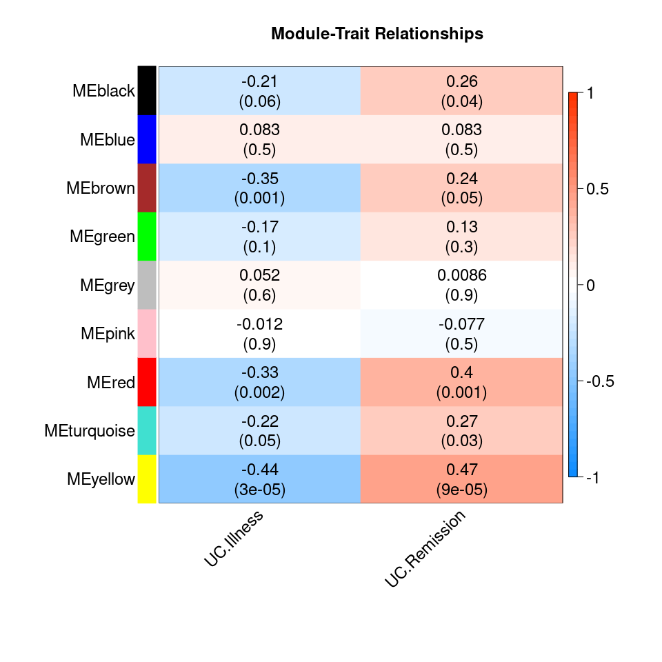

<!-- README.md is generated from README.Rmd. Please edit that file -->

# targidcn 

<!-- badges: start -->
<!-- badges: end -->

Target identification is an essential first step in drug discovery. This
package implements convenient functions for performing target
identification tasks on gene expression data using the WGCNA method.
(“cn” in the package name stands for “correlation network”.)

## Authors

-   Chen Liang <https://github.com/dzyim>

## Installation

You can install the development version of `targidcn` from
[GitHub](https://github.com/GHDDI-AILab/target-id-by-WGCNA).

``` r
if (!require("BiocManager", quietly = TRUE))
  install.packages("BiocManager")

BiocManager::install(c("GO.db", "preprocessCore", "impute"))  # Prerequisites for the WGCNA package
BiocManager::install(c("AnnotationDbi", "org.Hs.eg.db"))

if (!require("remotes", quietly = TRUE))
  install.packages("remotes")

remotes::install_github("GHDDI-AILab/target-id-by-WGCNA")
```

## Input data formats

The method can be applied to gene expression data generate by RNA-seq or
Mass Spectrometry (MS).

### RNA-seq data

(preprocessing not available so far)

### Labelled MS data

The expression levels of proteins are stored in the columns with the
prefixes `Ratio H/L` and `Ratio H/L normalized`.

### Label-free MS data

The expression levels of proteins are stored in the columns with the
prefixes `LFQ intensity` or similar.

## Details

R package `targidcn` contains:

-   Functions for loading raw data:
    -   `ReadExperimentalDesign()`: read raw data path, return an object
        of class `ExperimentInfo`
    -   `ReadPhenotypeTable()`: read a phenotype table, return an object
        of class `ExperimentInfo`
    -   `ReadProteinGroups()`: read raw data path, return an object of
        class `ProteinGroups`
-   S3 classes:
    -   `ExperimentList-class`
        -   `ExperimentInfo-class`: for storing sample information
        -   `ExpAssayTable-class`: for storing raw or QCed expression
            data, whose rows correspond to genes
            -   `ProteinGroups-class`: for storing raw or QCed
                proteomics data
        -   `ExpAssayFrame-class`: for storing QCed, scaled, normalized
            expression data, whose rows correspond to samples
            -   `CorrelationNetwork-class`: for storing storing
                expression data with correlation network(s)
-   S3 methods:
    -   `AddPhenotype()`
    -   `Subset()`
    -   `Tidy()`
    -   `QC()`
    -   `Reshape()`: convert an `ExpAssayTable` object to an
        `ExpAssayFrame` object
    -   `LogTransform()`
    -   `Normalize()`
    -   `Histogram()`
    -   `SampleTree()`
    -   `PickThreshold()`
    -   `AddNetwork()`
    -   `ModulePlot()`
    -   `AddConnectivity()`
    -   `GetConnectivity()`
    -   `GetHubGenes()`
    -   `ModuleSignificance()`
    -   `BindModuleSignificance()`
    -   `ModuleTraitHeatmap()`
    -   `GeneSignificance()`
    -   `ModuleMembership()`
    -   `GetRelatedHubGenes()`
    -   `GetSignificantGenes()`

## Tutorial

``` r
library(data.table)
library(magrittr)
library(targidcn) %>% suppressMessages()

datadir = system.file("extdata", "MS_label-free", "MaxQuantOutput_50", package = "targidcn")
pheno = ReadPhenotypeTable(file.path(datadir, "phenotype.txt"))
assay = ReadProteinGroups(datadir, col = "Intensity")
assay
#> An object of class ProteinGroups
#> 
#> 111 Experiment(s): "UCA_1", "UCA_2", "UCA_3", ...
#> 1 Assay(s): "Intensity"
#>  853 features across 111 samples within assay 1.
```

``` r
cn = assay %>% 
  AddPhenotype(pheno) %>% 
  Tidy() %>% 
  QC() %>% 
  Reshape() %>% 
  LogTransform() %>% 
  Normalize() %>% 
  AddNetwork(power = 3) %>% 
  AddConnectivity()
#> Warning in QC.ProteinGroups(.): No column for checking false hits!
#> Warning in QC.ProteinGroups(.): No column for checking unique peptides!
#> ..connectivity..
#> ..matrix multiplication (system BLAS)..
#> ..normalization..
#> ..done.
#>  ..cutHeight not given, setting it to 0.983  ===>  99% of the (truncated) height range in dendro.
#>  ..done.
#>  mergeCloseModules: Merging modules whose distance is less than 0.15
#>    Calculating new MEs...
```

``` r
cn
#> An object of class CorrelationNetwork
#> 
#> 111 Experiment(s): "UCA_1", "UCA_2", "UCA_3", ...
#> 1 Assay(s): "Intensity"
#>  846 features across 111 samples within assay 1.
#> 
#> Attributes:
#> List of 5
#>  $ phenotype    :'data.frame':   111 obs. of  3 variables:
#>   ..$ Diagnosis: chr [1:111] "UC" "UC" "UC" "UC" ...
#>   ..$ Illness  : int [1:111] 1 1 1 1 1 1 1 1 1 1 ...
#>   ..$ Remission: int [1:111] 0 0 0 0 0 0 0 0 0 0 ...
#>  $ QC           :Classes 'data.table' and 'data.frame':  1 obs. of  6 variables:
#>   ..$ Assay                         : chr "Intensity"
#>   ..$ Raw data                      : int 853
#>   ..$ Remove false hits             : int 853
#>   ..$ With gene names               : int 853
#>   ..$ Unique peptides >= 2          : int 853
#>   ..$ goodGenes, min.fraction >= 0.5: int 846
#>   ..- attr(*, ".internal.selfref")=<externalptr> 
#>  $ powerEstimate: list()
#>  $ network      :List of 1
#>   ..$ Intensity:List of 10
#>   .. ..$ power           : num 3
#>   .. ..$ MEDissThres     : num 0.15
#>   .. ..$ minModuleSize   : num 30
#>   .. ..$ adjacency       : num [1:846, 1:846] 1.00 4.22e-04 1.86e-02 1.15e-03 1.42e-06 ...
#>   .. .. ..- attr(*, "dimnames")=List of 2
#>   .. .. .. ..$ : chr [1:846] "A1BG" "AGR2" "ANXA2.ANXA2P2" "BSG" ...
#>   .. .. .. ..$ : chr [1:846] "A1BG" "AGR2" "ANXA2.ANXA2P2" "BSG" ...
#>   .. ..$ dissTOM         : num [1:846, 1:846] 0 0.971 0.966 0.977 0.982 ...
#>   .. ..$ geneTree        :List of 7
#>   .. .. ..$ merge      : int [1:845, 1:2] -17 -23 -18 -173 2 -597 5 -16 7 -431 ...
#>   .. .. ..$ height     : num [1:845] 0.69 0.704 0.712 0.731 0.736 ...
#>   .. .. ..$ order      : int [1:846] 84 218 796 103 587 250 43 506 712 729 ...
#>   .. .. ..$ labels     : NULL
#>   .. .. ..$ method     : chr "average"
#>   .. .. ..$ call       : language fastcluster::hclust(d = stats::as.dist(dissTOM), method = "average")
#>   .. .. ..$ dist.method: NULL
#>   .. .. ..- attr(*, "class")= chr "hclust"
#>   .. ..$ moduleEigengenes:'data.frame':  111 obs. of  9 variables:
#>   .. .. ..$ MEgreen    : num [1:111] -0.0135 -0.0209 -0.0261 -0.1224 0.1697 ...
#>   .. .. ..$ MEred      : num [1:111] -0.2495 0.0877 0.0825 -0.0354 -0.1802 ...
#>   .. .. ..$ MEyellow   : num [1:111] -0.1074 0.0552 -0.0138 -0.047 -0.1454 ...
#>   .. .. ..$ MEblack    : num [1:111] -0.0267 0.00353 0.00812 -0.02159 -0.00316 ...
#>   .. .. ..$ MEbrown    : num [1:111] -0.2845 -0.0676 0.0772 -0.1323 0.1018 ...
#>   .. .. ..$ MEpink     : num [1:111] -0.1212 -0.2116 -0.1069 -0.0872 -0.0322 ...
#>   .. .. ..$ MEblue     : num [1:111] 0.0814 0.0795 -0.0697 -0.0374 -0.2185 ...
#>   .. .. ..$ MEturquoise: num [1:111] -0.00106 0.09628 -0.09388 -0.17701 -0.15742 ...
#>   .. .. ..$ MEgrey     : num [1:111] NaN NaN 0.675 0.539 NaN ...
#>   .. ..$ moduleColors    : Named chr [1:846] "green" "blue" "black" "brown" ...
#>   .. .. ..- attr(*, "names")= chr [1:846] "A1BG" "AGR2" "ANXA2.ANXA2P2" "BSG" ...
#>   .. ..$ moduleLabels    : Named num [1:846] 5 2 7 3 1 7 6 6 6 3 ...
#>   .. .. ..- attr(*, "names")= chr [1:846] "A1BG" "AGR2" "ANXA2.ANXA2P2" "BSG" ...
#>   .. ..$ unmergedColors  : Named chr [1:846] "green" "blue" "black" "brown" ...
#>   .. .. ..- attr(*, "names")= chr [1:846] "A1BG" "AGR2" "ANXA2.ANXA2P2" "BSG" ...
#>  $ connectivity :List of 1
#>   ..$ Intensity:Classes 'data.table' and 'data.frame':   846 obs. of  6 variables:
#>   .. ..$ gene   : chr [1:846] "ACTBL2" "DCN" "COL6A2" "COL6A1" ...
#>   .. ..$ kTotal : num [1:846] 2.14 56.14 52.72 52.42 56.4 ...
#>   .. ..$ kWithin: num [1:846] 0 29.6 27.5 27.3 26.2 ...
#>   .. ..$ kOut   : num [1:846] 2.14 26.57 25.27 25.17 30.17 ...
#>   .. ..$ kDiff  : num [1:846] -2.14 3 2.18 2.09 -3.94 ...
#>   .. ..$ module : num [1:846] 0 1 1 1 1 1 1 1 1 1 ...
#>   .. ..- attr(*, ".internal.selfref")=<externalptr>
```

``` r
cn %>% Histogram(preview = TRUE)
#> Warning: Removed 14993 rows containing non-finite values (stat_bin).
```


``` r
cn %>% SampleTree(preview = TRUE)
```


``` r
cn %>% ModulePlot(preview = TRUE)
```


``` r
cn %>% GetHubGenes()
#>          gene         ensembl
#>  1:       DCN ENSG00000011465
#>  2:    COL6A2 ENSG00000142173
#>  3:    COL6A1 ENSG00000142156
#>  4:      ENO1 ENSG00000074800
#>  5:     RPS25 ENSG00000118181
#>  6:    TUBB4B ENSG00000188229
#>  7:     RPL24 ENSG00000114391
#>  8:      AGR2 ENSG00000106541
#>  9:    ATP1A1 ENSG00000163399
#> 10:    ATP12A ENSG00000075673
#> 11:       DLD ENSG00000091140
#> 12:      ACO2 ENSG00000100412
#> 13:      ETFB ENSG00000105379
#> 14:    SUCLG2 ENSG00000172340
#> 15:  DYNC1LI2 ENSG00000135720
#> 16:      SBDS ENSG00000126524
#> 17:     HCFC1 ENSG00000172534
#> 18:     CDH17 ENSG00000079112
#> 19:      NPM3 ENSG00000107833
#> 20:    SUCLG1 ENSG00000163541
#> 21:     YWHAH ENSG00000128245
#> 22:     RPL23 ENSG00000125691
#> 23: HIST1H2BC            <NA>
#>          gene         ensembl
#>                                                                       fullname
#>  1:                                                                    decorin
#>  2:                                             collagen type VI alpha 2 chain
#>  3:                                             collagen type VI alpha 1 chain
#>  4:                                                                  enolase 1
#>  5:                                                      ribosomal protein S25
#>  6:                                                  tubulin beta 4B class IVb
#>  7:                                                      ribosomal protein L24
#>  8:            anterior gradient 2, protein disulphide isomerase family member
#>  9:                                 ATPase Na+/K+ transporting subunit alpha 1
#> 10:                       ATPase H+/K+ transporting non-gastric alpha2 subunit
#> 11:                                             dihydrolipoamide dehydrogenase
#> 12:                                                                aconitase 2
#> 13:                                electron transfer flavoprotein subunit beta
#> 14:                              succinate-CoA ligase GDP-forming subunit beta
#> 15:                            dynein cytoplasmic 1 light intermediate chain 2
#> 16:                                            SBDS ribosome maturation factor
#> 17:                                                        host cell factor C1
#> 18:                                                                cadherin 17
#> 19:                                              nucleophosmin/nucleoplasmin 3
#> 20:                         succinate-CoA ligase GDP/ADP-forming subunit alpha
#> 21: tyrosine 3-monooxygenase/tryptophan 5-monooxygenase activation protein eta
#> 22:                                                      ribosomal protein L23
#> 23:                                                                       <NA>
#>                                                                       fullname
#>       kTotal   kWithin     kOut      kDiff module
#>  1: 56.14273 29.570062 26.57267   2.997397      1
#>  2: 52.72106 27.451019 25.27004   2.180978      1
#>  3: 52.42157 27.255657 25.16592   2.089741      1
#>  4: 44.08754 21.350882 22.73665  -1.385772      2
#>  5: 44.03379 20.308507 23.72528  -3.416776      2
#>  6: 37.38324 19.752458 17.63079   2.121672      2
#>  7: 36.75099 19.728635 17.02235   2.706283      2
#>  8: 43.46318 19.446931 24.01625  -4.569318      2
#>  9: 33.20704 17.947858 15.25918   2.688678      3
#> 10: 45.83748 17.526120 28.31136 -10.785238      3
#> 11: 44.44262 12.827396 31.61522 -18.787827      4
#> 12: 32.37281 12.568779 19.80403  -7.235247      4
#> 13: 34.58275 12.419244 22.16351  -9.744267      4
#> 14: 40.26666 11.816279 28.45038 -16.634106      4
#> 15: 28.64873  9.266127 19.38261 -10.116478      5
#> 16: 29.79841  6.367648 23.43076 -17.063115      6
#> 17: 24.93830  6.275199 18.66310 -12.387904      6
#> 18: 30.17024  6.118044 24.05219 -17.934149      6
#> 19: 20.88186  5.978140 14.90372  -8.925581      6
#> 20: 21.61422  5.819644 15.79458  -9.974933      6
#> 21: 20.37742  6.312695 14.06472  -7.752027      7
#> 22: 21.98200  6.074109 15.90789  -9.833780      7
#> 23: 28.50703  7.545801 20.96123 -13.415429      8
#>       kTotal   kWithin     kOut      kDiff module
```

``` r
samples1 = pheno$table[is.na(Remission) | Remission == 0, Experiment]
samples2 = pheno$table[!is.na(Remission), Experiment]
mt1 = ModuleSignificance(cn, samples = samples1, traits = "Illness", prefix = "UC")
mt2 = ModuleSignificance(cn, samples = samples2, traits = "Remission", prefix = "UC")
mt = BindModuleSignificance(mt1, mt2)
```

``` r
mt %>% ModuleTraitHeatmap(preview = TRUE)
```



``` r
mt %>% GetRelatedHubGenes()
#>       gene         ensembl                                             fullname
#>  1: ATP1A1 ENSG00000163399           ATPase Na+/K+ transporting subunit alpha 1
#>  2: ATP12A ENSG00000075673 ATPase H+/K+ transporting non-gastric alpha2 subunit
#>  3:    DLD ENSG00000091140                       dihydrolipoamide dehydrogenase
#>  4:   ACO2 ENSG00000100412                                          aconitase 2
#>  5:   ETFB ENSG00000105379          electron transfer flavoprotein subunit beta
#>  6: SUCLG2 ENSG00000172340        succinate-CoA ligase GDP-forming subunit beta
#>  7:   SBDS ENSG00000126524                      SBDS ribosome maturation factor
#>  8:  HCFC1 ENSG00000172534                                  host cell factor C1
#>  9:  CDH17 ENSG00000079112                                          cadherin 17
#> 10:   NPM3 ENSG00000107833                        nucleophosmin/nucleoplasmin 3
#> 11: SUCLG1 ENSG00000163541   succinate-CoA ligase GDP/ADP-forming subunit alpha
#>       kTotal   kWithin     kOut      kDiff module
#>  1: 33.20704 17.947858 15.25918   2.688678      3
#>  2: 45.83748 17.526120 28.31136 -10.785238      3
#>  3: 44.44262 12.827396 31.61522 -18.787827      4
#>  4: 32.37281 12.568779 19.80403  -7.235247      4
#>  5: 34.58275 12.419244 22.16351  -9.744267      4
#>  6: 40.26666 11.816279 28.45038 -16.634106      4
#>  7: 29.79841  6.367648 23.43076 -17.063115      6
#>  8: 24.93830  6.275199 18.66310 -12.387904      6
#>  9: 30.17024  6.118044 24.05219 -17.934149      6
#> 10: 20.88186  5.978140 14.90372  -8.925581      6
#> 11: 21.61422  5.819644 15.79458  -9.974933      6
```

## References

**Analysis of oncogenic signaling networks in glioblastoma identifies
ASPM as a molecular target.**  
Horvath S, Zhang B, Carlson M, et al.  
PNAS. 2006;103(46):17402-17407. <doi:10.1073/pnas.0608396103>

**WGCNA: an R package for weighted correlation network analysis.**  
Langfelder P, Horvath S.  
BMC Bioinformatics. 2008;9:559. <doi:10.1186/1471-2105-9-559>

**Structural weakening of the colonic mucus barrier is an early event in
ulcerative colitis pathogenesis.**  
van der Post S, Jabbar KS, Birchenough G, et al.  
Gut. 2019;68(12):2142-2151. <doi:10.1136/gutjnl-2018-317571>

<!-- 
You'll still need to render `README.Rmd` regularly, to keep `README.md` up-to-date. 
`devtools::build_readme()` is handy for this. You could also use GitHub Actions to 
re-render `README.Rmd` every time you push. An example workflow can be found here: 
<https://github.com/r-lib/actions/tree/v1/examples>.
--->
