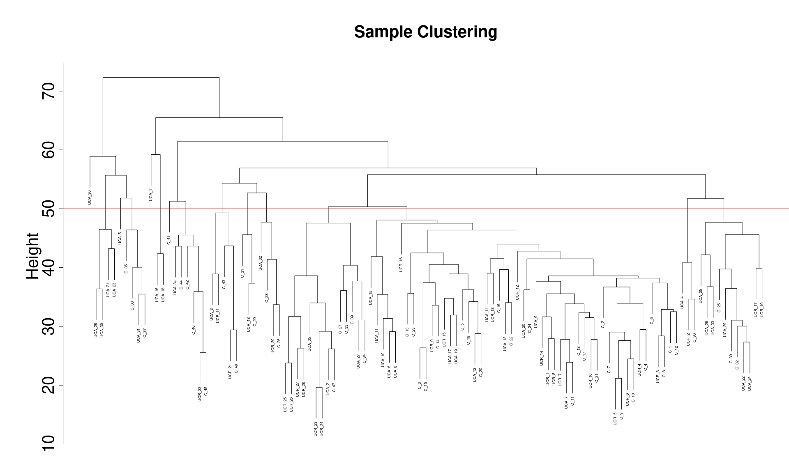

<!-- README.md is generated from README.Rmd. Please edit that file -->

# targidcn 

<!-- badges: start -->
<!-- badges: end -->

Target identification is an essential first step in drug discovery. This
package implements convenient functions for performing target
identification tasks on gene expression data using the WGCNA method.
(“cn” in the package name stands for “correlation network”.)

## Authors

-   Chen Liang <https://github.com/dzyim>

## Installation

You can install the development version of `targidcn` from
[GitHub](https://github.com/).

``` r
if (!require("BiocManager", quietly = TRUE))
  install.packages("BiocManager")

BiocManager::install(c("AnnotationDbi", "GO.db", "org.Hs.eg.db", "preprocessCore", "impute"))

if (!require("remotes", quietly = TRUE))
  install.packages("remotes")

remotes::install_github("GHDDI-AILab/target-id-by-WGCNA")
```

## Input data formats

The method can be applied to gene expression data generate by RNA-seq or
Mass Spectrometry (MS).

### RNA-seq data

(preprocessing not available so far)

### Labelled MS data

The expression levels of proteins are stored in the columns with the
prefixes `Ratio H/L` and `Ratio H/L normalized`.

### Label-free MS data

The expression levels of proteins are stored in the columns with the
prefixes `LFQ intensity` or `Intensity`.

## Details

R package `targidcn` contains:

-   Functions for loading raw data:
    -   `ReadExperimentalDesign()`: read raw data path, return an object
        of class `ExperimentInfo`
    -   `ReadProteinGroups()`: read raw data path, return an object of
        class `ProteinGroups`
-   S3 classes:
    -   `ExperimentList-class`
        -   `ExperimentInfo-class`: for storing sample information
        -   `ExpAssayTable-class`: for storing raw or QCed expression
            data, whose rows correspond to genes
            -   `ProteinGroups-class`: for storing raw or QCed
                proteomics data
        -   `ExpAssayFrame-class`: for storing QCed, scaled, normalized
            expression data, whose rows correspond to samples
            -   `CorrelationNetwork-class`: for storing storing
                expression data with correlation network(s)
-   S3 methods:
    -   `Subset()`
    -   `Tidy()`
    -   `QC()`
    -   `Reshape()`: convert an `ExpAssayTable` object to an
        `ExpAssayFrame` object
    -   `LogTransform()`
    -   `Normalize()`
    -   `Histogram()`
    -   `SampleTree()`
    -   `PickThreshold()`
    -   `AddNetwork()`
    -   `ModulePlot()`
    -   `AddConnectivity()`
    -   `GetConnectivity()`
    -   `GetHubGenes()`

## Tutorial

``` r
library(magrittr)
library(targidcn) %>% suppressMessages()

datadir = system.file("extdata", "MS_label-free", package = "targidcn")
assay = ReadProteinGroups(datadir)
assay
#> An object of class ProteinGroups
#> 
#> 111 Experiment(s): "147", "151", "162", ...
#> 1 Assay(s): "Intensity"
#>  1591 features across 111 samples within assay 1.
```

``` r
attributes(assay)
#> $names
#> [1] "Intensity"
#> 
#> $experiments
#>   [1] "147" "151" "162" "167" "170" "216" "217" "218" "220" "221" "224" "241"
#>  [13] "242" "245" "248" "249" "251" "253" "254" "255" "256" "257" "259" "260"
#>  [25] "261" "262" "263" "265" "268" "269" "270" "271" "272" "273" "275" "276"
#>  [37] "277" "281" "282" "284" "285" "286" "289" "290" "292" "511" "518" "519"
#>  [49] "520" "522" "526" "527" "530" "536" "552" "554" "556" "557" "558" "560"
#>  [61] "561" "563" "564" "566" "567" "569" "570" "572" "573" "574" "575" "576"
#>  [73] "577" "578" "580" "581" "584" "585" "586" "587" "588" "589" "591" "594"
#>  [85] "596" "599" "602" "603" "604" "605" "611" "612" "613" "614" "615" "617"
#>  [97] "618" "619" "620" "621" "622" "623" "624" "625" "626" "627" "628" "629"
#> [109] "630" "631" "632"
#> 
#> $filename
#> [1] "/tmp/Rtmp27Eljd/temp_libpath3abcd63e96cbc/targidcn/extdata/MS_label-free/MaxQuantOutput/proteinGroups.txt"
#> 
#> $class
#> [1] "ProteinGroups"  "ExpAssayTable"  "ExperimentList" "list"
```

``` r
cn = 
  assay %>% 
  Tidy() %>% 
  QC() %>% 
  Reshape() %>% 
  LogTransform() %>% 
  Normalize() %>% 
  PickThreshold() %>% 
  AddNetwork() %>% 
  AddConnectivity()
#> Warning: executing %dopar% sequentially: no parallel backend registered
#>    Power SFT.R.sq slope truncated.R.sq mean.k. median.k. max.k.
#> 1      1    0.230 -1.79         0.9890 160.000  1.58e+02  268.0
#> 2      2    0.533 -1.68         0.9790  48.900  4.54e+01  123.0
#> 3      3    0.789 -1.67         0.9460  18.800  1.61e+01   65.5
#> 4      4    0.877 -1.93         0.9180   8.470  6.37e+00   43.9
#> 5      5    0.922 -1.98         0.9130   4.310  2.81e+00   33.8
#> 6      6    0.931 -1.88         0.9130   2.430  1.31e+00   28.5
#> 7      7    0.324 -2.89         0.1830   1.510  6.56e-01   25.6
#> 8      8    0.314 -2.60         0.1580   1.020  3.49e-01   23.8
#> 9      9    0.191 -2.44        -0.0318   0.750  1.90e-01   22.8
#> 10    10    0.296 -2.14         0.1330   0.588  1.06e-01   22.2
#> 11    12    0.149 -1.73        -0.0766   0.422  3.58e-02   21.5
#> 12    14    0.192 -1.78        -0.0362   0.346  1.26e-02   21.2
#> 13    16    0.284 -1.55         0.1410   0.306  4.73e-03   21.1
#> 14    18    0.283 -1.47         0.1440   0.282  1.80e-03   21.1
#> 15    20    0.285 -1.41         0.1480   0.265  7.18e-04   21.0
#> ..connectivity..
#> ..matrix multiplication (system BLAS)..
#> ..normalization..
#> ..done.
#>  ..cutHeight not given, setting it to 0.994  ===>  99% of the (truncated) height range in dendro.
#>  ..done.
#>  mergeCloseModules: Merging modules whose distance is less than 0.15
#>    Calculating new MEs...
```

``` r
cn
#> An object of class CorrelationNetwork
#> 
#> 111 Experiment(s): "147", "151", "162", ...
#> 1 Assay(s): "Intensity"
#>  818 features across 111 samples within assay 1.
#> 
#> Attributes:
#> List of 5
#>  $ filename     : chr "/tmp/Rtmp27Eljd/temp_libpath3abcd63e96cbc/targidcn/extdata/MS_label-free/MaxQuantOutput/proteinGroups.txt"
#>  $ QC           :Classes 'data.table' and 'data.frame':  1 obs. of  6 variables:
#>   ..$ Assay                         : chr "Intensity"
#>   ..$ Raw data                      : int 1591
#>   ..$ Remove false hits             : int 1531
#>   ..$ With gene names               : int 1509
#>   ..$ Unique peptides >= 2          : int 1126
#>   ..$ goodGenes, min.fraction >= 0.5: int 818
#>   ..- attr(*, ".internal.selfref")=<externalptr> 
#>  $ powerEstimate:List of 1
#>   ..$ Intensity: num 4
#>  $ network      :List of 1
#>   ..$ Intensity:List of 10
#>   .. ..$ power         : num 4
#>   .. ..$ MEDissThres   : num 0.15
#>   .. ..$ minModuleSize : num 30
#>   .. ..$ adjacency     : num [1:818, 1:818] 1.00 3.10e-07 6.58e-10 9.50e-04 1.13e-03 ...
#>   .. .. ..- attr(*, "dimnames")=List of 2
#>   .. .. .. ..$ : chr [1:818] "CLCA1" "IGLL5;IGLC1" "PDLIM1" "MYO1C" ...
#>   .. .. .. ..$ : chr [1:818] "CLCA1" "IGLL5;IGLC1" "PDLIM1" "MYO1C" ...
#>   .. ..$ dissTOM       : num [1:818, 1:818] 0 0.995 0.994 0.992 0.992 ...
#>   .. ..$ geneTree      :List of 7
#>   .. .. ..$ merge      : int [1:817, 1:2] -65 -670 1 -359 3 -232 -794 -77 5 -191 ...
#>   .. .. ..$ height     : num [1:817] 0.392 0.403 0.435 0.458 0.468 ...
#>   .. .. ..$ order      : int [1:818] 265 675 628 62 56 403 630 366 479 627 ...
#>   .. .. ..$ labels     : NULL
#>   .. .. ..$ method     : chr "average"
#>   .. .. ..$ call       : language fastcluster::hclust(d = stats::as.dist(dissTOM), method = "average")
#>   .. .. ..$ dist.method: NULL
#>   .. .. ..- attr(*, "class")= chr "hclust"
#>   .. ..$ MEs           :'data.frame':    111 obs. of  7 variables:
#>   .. .. ..$ MEgreen    : num [1:111] 0.0244 0.1157 -0.0578 0.0668 0.0986 ...
#>   .. .. ..$ MEturquoise: num [1:111] 0.0927 0.1283 0.1358 0.1086 0.0934 ...
#>   .. .. ..$ MEblue     : num [1:111] 0.0447 0.0442 0.1142 0.1116 0.0294 ...
#>   .. .. ..$ MEyellow   : num [1:111] 0.0267 0.0481 0.0396 0.044 0.0705 ...
#>   .. .. ..$ MEred      : num [1:111] -0.051965 -0.094088 -0.011963 0.000277 -0.05732 ...
#>   .. .. ..$ MEblack    : num [1:111] -0.04727 0.00409 0.01239 -0.05464 0.06629 ...
#>   .. .. ..$ MEbrown    : num [1:111] 0.0306 0.1201 0.0131 -0.0917 0.1399 ...
#>   .. ..$ moduleColors  : Named chr [1:818] "green" "yellow" "blue" "blue" ...
#>   .. .. ..- attr(*, "names")= chr [1:818] "CLCA1" "IGLL5;IGLC1" "PDLIM1" "MYO1C" ...
#>   .. ..$ moduleLabels  : Named num [1:818] 5 4 2 2 1 1 3 1 3 3 ...
#>   .. .. ..- attr(*, "names")= chr [1:818] "CLCA1" "IGLL5;IGLC1" "PDLIM1" "MYO1C" ...
#>   .. ..$ unmergedColors: Named chr [1:818] "green" "yellow" "blue" "blue" ...
#>   .. .. ..- attr(*, "names")= chr [1:818] "CLCA1" "IGLL5;IGLC1" "PDLIM1" "MYO1C" ...
#>  $ connectivity :List of 1
#>   ..$ Intensity:Classes 'data.table' and 'data.frame':   818 obs. of  6 variables:
#>   .. ..$ gene   : chr [1:818] "ALDH1A1" "CLYBL" "SNRPB;SNRPN" "CHMP5" ...
#>   .. ..$ kTotal : num [1:818] 43.9 43.9 41.2 37.5 36.2 ...
#>   .. ..$ kWithin: num [1:818] 32 32 28 27.6 27.3 ...
#>   .. ..$ kOut   : num [1:818] 11.92 11.92 13.15 9.95 8.93 ...
#>   .. ..$ kDiff  : num [1:818] 20.1 20.1 14.9 17.6 18.3 ...
#>   .. ..$ module : num [1:818] 1 1 1 1 1 1 1 1 1 1 ...
#>   .. ..- attr(*, ".internal.selfref")=<externalptr>
```

``` r
cn %>% Histogram(preview = TRUE)
#> Warning: Removed 15206 rows containing non-finite values (stat_bin).
```



``` r
cn %>% SampleTree(preview = TRUE)
```


``` r
cn %>% ModulePlot(preview = TRUE)
```


``` r
cn %>% GetHubGenes()
#>        gene         ensembl                                   fullname   kTotal
#>  1: ALDH1A1 ENSG00000165092  aldehyde dehydrogenase 1 family member A1 43.89376
#>  2:   CLYBL ENSG00000125246                       citramalyl-CoA lyase 43.89376
#>  3:  SPTBN1 ENSG00000115306          spectrin beta, non-erythrocytic 1 24.85082
#>  4:    MDH2 ENSG00000146701                     malate dehydrogenase 2 26.49073
#>  5: HSP90B1 ENSG00000166598 heat shock protein 90 beta family member 1 15.48458
#>  6:    SCIN ENSG00000006747                                  scinderin 22.50675
#>  7:     HPX ENSG00000110169                                  hemopexin 32.85560
#>  8:    CDV3 ENSG00000091527                               CDV3 homolog 30.07123
#>  9:   RAB2A ENSG00000104388          RAB2A, member RAS oncogene family 30.50436
#> 10:    TPM3 ENSG00000143549                              tropomyosin 3 26.24318
#> 11:   RPS18 ENSG00000231500                      ribosomal protein S18 22.13689
#> 12:   RBM8A ENSG00000265241               RNA binding motif protein 8A 10.39302
#> 13:   ECHS1 ENSG00000127884         enoyl-CoA hydratase, short chain 1 14.96758
#> 14:  RPL23A ENSG00000198242                     ribosomal protein L23a 12.97417
#>       kWithin      kOut      kDiff module
#>  1: 31.972834 11.920928 20.0519059      1
#>  2: 31.972834 11.920928 20.0519059      1
#>  3: 14.057922 10.792901  3.2650213      2
#>  4: 13.007820 13.482913 -0.4750932      2
#>  5:  9.536351  5.948226  3.5881251      3
#>  6:  9.011228 13.495519 -4.4842908      3
#>  7: 15.300028 17.555571 -2.2555426      4
#>  8: 14.591160 15.480066 -0.8889061      4
#>  9: 13.880218 16.624144 -2.7439255      4
#> 10:  9.382158 16.861017 -7.4788592      5
#> 11:  9.114045 13.022842 -3.9087972      5
#> 12:  3.814425  6.578593 -2.7641682      6
#> 13:  3.981047 10.986535 -7.0054880      7
#> 14:  3.644575  9.329599 -5.6850232      7
```

## References

**Analysis of oncogenic signaling networks in glioblastoma identifies
ASPM as a molecular target.**  
Horvath S, Zhang B, Carlson M, et al.  
PNAS. 2006;103(46):17402-17407. <doi:10.1073/pnas.0608396103>

**WGCNA: an R package for weighted correlation network analysis.**  
Langfelder P, Horvath S.  
BMC Bioinformatics. 2008;9:559. <doi:10.1186/1471-2105-9-559>

**Structural weakening of the colonic mucus barrier is an early event in
ulcerative colitis pathogenesis.**  
van der Post S, Jabbar KS, Birchenough G, et al.  
Gut. 2019;68(12):2142-2151. <doi:10.1136/gutjnl-2018-317571>

<!-- 
You'll still need to render `README.Rmd` regularly, to keep `README.md` up-to-date. `devtools::build_readme()` is handy for this. You could also use GitHub Actions to re-render `README.Rmd` every time you push. An example workflow can be found here: <https://github.com/r-lib/actions/tree/v1/examples>.
--->
